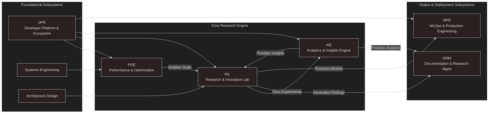

# Welcome to the Project NEXUS Community Wiki!

**Project NEXUS is an open-source, end-to-end research platform for Multi-Agent Reinforcement Learning (MARL), designed to explore the frontiers of emergent coordination and communication.**

This document serves as the central knowledge base for the project. Whether you're a researcher looking to run experiments, a developer looking to contribute, or just curious about the future of collaborative AI, you're in the right place.

---

### Table of Contents

* [Project Vision & Roadmap](#project-vision--roadmap)
* [System Architecture](#system-architecture)
* [For Researchers: Running Your First Experiment](#for-researchers-running-your-first-experiment)
* [For Contributors: How to Get Involved](#for-contributors-how-to-get-involved)

---

## Project Vision & Roadmap

This section outlines the planned development trajectory for Project NEXUS. Our roadmap is divided into three horizons, each representing a distinct phase of the project's evolution from a robust research tool into a pioneering platform for discovering the principles of emergent intelligence.

### Horizon 1: The Proving Ground (Next 3 Months - Q4 2025)
**Theme:** Solidify the foundation, unlock performance, and build the community on-ramp.
* **🌱 Goal: Activate the Open Source Ecosystem** (DPE)
* **⚡ Goal: Achieve Hyperscale Performance** (POE)
* **🔬 Goal: Lay the Foundation for Advanced Research** (RIL/AIE)

### Horizon 2: The Crucible (Next 4-9 Months - Q1-Q2 2026)
**Theme:** Forge novel research contributions and mature the platform's capabilities.
* **🏆 Goal: Publish First Novel Research Contribution**
* **🧠 Goal: Mature the Agent's Mind**
* **🌍 Goal: Expand the World**

### Horizon 3: The Genesis Chamber (1-3+ Years - Q3 2026 & Beyond)
**Theme:** Pursue the grand challenge of simulating an emergent digital civilization.
* **🌌 Goal: Architect the Digital Sandbox**
* **🧬 Goal: Engineer the Evolving Mind**
* **🔥 Goal: Witness the Spark of Culture**

---

## System Architecture

This section provides a high-level overview of the technical design of Project NEXUS for those who want to understand how it works under the hood.

### The 8-Subsystem Model

Project NEXUS is organized into eight distinct but interconnected subsystems to manage complexity and focus development. The graph below shows how these subsystems interact.

