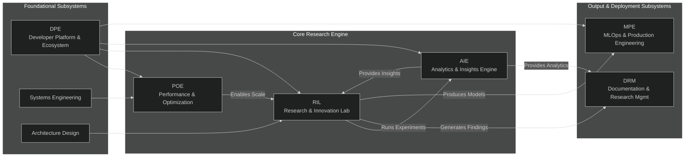

Markdown

# Welcome to the Project NEXUS Community Wiki!

**Project NEXUS is an open-source, end-to-end research platform for Multi-Agent Reinforcement Learning (MARL), designed to explore the frontiers of emergent coordination and communication.**

This document serves as the central knowledge base for the project. Whether you're a researcher looking to run experiments, a developer looking to contribute, or just curious about the future of collaborative AI, you're in the right place.

---

### Table of Contents

* [Project Vision & Roadmap](#project-vision--roadmap)
* [System Architecture](#system-architecture)
* [For Researchers: Running Your First Experiment](#for-researchers-running-your-first-experiment)
* [For Contributors: How to Get Involved](#for-contributors-how-to-get-involved)

---

## Project Vision & Roadmap

This section outlines the planned development trajectory for Project NEXUS. Our roadmap is divided into three horizons, each representing a distinct phase of the project's evolution from a robust research tool into a pioneering platform for discovering the principles of emergent intelligence.

### Horizon 1: The Proving Ground (Next 3 Months - Q4 2025)
**Theme:** Solidify the foundation, unlock performance, and build the community on-ramp.
* **🌱 Goal: Activate the Open Source Ecosystem** (DPE)
* **⚡ Goal: Achieve Hyperscale Performance** (POE)
* **🔬 Goal: Lay the Foundation for Advanced Research** (RIL/AIE)

### Horizon 2: The Crucible (Next 4-9 Months - Q1-Q2 2026)
**Theme:** Forge novel research contributions and mature the platform's capabilities.
* **🏆 Goal: Publish First Novel Research Contribution**
* **🧠 Goal: Mature the Agent's Mind**
* **🌍 Goal: Expand the World**

### Horizon 3: The Genesis Chamber (1-3+ Years - Q3 2026 & Beyond)
**Theme:** Pursue the grand challenge of simulating an emergent digital civilization.
* **🌌 Goal: Architect the Digital Sandbox**
* **🧬 Goal: Engineer the Evolving Mind**
* **🔥 Goal: Witness the Spark of Culture**

---

## System Architecture

This section provides a high-level overview of the technical design of Project NEXUS for those who want to understand how it works under the hood.

### The 8-Subsystem Model

Project NEXUS is organized into eight distinct but interconnected subsystems to manage complexity and focus development. The graph below shows how these subsystems interact.


The Agent Architecture
The core of the project is the NEXUS agent. Its "mind" is a neural network that processes information from multiple sources simultaneously (multi-modal fusion):

Spatial Input: A Convolutional Neural Network (CNN) processes the visual state of the grid world.

Proprioceptive Input: A simple feed-forward network processes the agent's own internal state (e.g., position, inventory).

Communication Input: The agent receives communication tokens from other agents.

These inputs are fused before being passed to a policy network that decides the agent's next action.

For Researchers: Running Your First Experiment
This guide provides a step-by-step tutorial to get you from cloning the repository to running your first baseline multi-agent training experiment.

Prerequisites
Before you begin, please ensure you have the following software installed:

Git: For cloning the repository.

Miniconda or Anaconda: We use the Conda package manager to ensure a reproducible environment.

Step-by-Step Guide
1. Clone the Repository
Open your terminal, navigate to your desired directory, and clone the repository.

```Bash
git clone [https://github.com/curtisreker-creator/project-nexus.git](https://github.com/curtisreker-creator/project-nexus.git)
cd project-nexus
```
2. Set Up the Conda Environment
Use the provided environment file to create a new, isolated Conda environment.

```Bash
conda env create -f environment.yml
```
3. Activate the Environment
You must activate the environment every time you open a new terminal to work on the project.

```Bash
conda activate project-nexus]
```
4. Launch a Training Run
You are now ready to start! Launch the training script from the root directory of the project:

```Bash
python scripts/train.py --config configs/default.yml
```
5. Monitor the Output
You should see output in your terminal indicating that the training process has begun. Congratulations!

Understanding the Results
The script will create a new directory in the results/ folder containing logs, model checkpoints, and a copy of your configuration file.

Next Steps
The best way to learn is by experimenting! Try changing a parameter in configs/default.yml (like the learning_rate) and re-running to see how it affects performance.

For Contributors: How to Get Involved
We are thrilled that you're interested in contributing! This project is built by and for the community, and we welcome all contributions.

The Golden Rules
For all contributions, please first read our CONTRIBUTING.md and CODE_OF_CONDUCT.md files in the root of the repository.

How to Contribute
Find an Issue: The best place to start is the Issues tab. Look for issues tagged with good first issue.

Claim the Issue: Leave a comment on the issue to let everyone know you're working on it.

Create a Pull Request: Once you've completed the work, submit a pull request and link it back to the original issue. Our CI pipeline will automatically test your changes.

Guide to the Codebase by Subsystem
Interested in performance and scaling? Check out the work of the POE subsystem, primarily in the scripts/ and core training loop files.

Fascinated by agent minds and learning algorithms? The RIL's work is centered in the agents/ directory.

Want to improve the developer experience? The DPE focuses on our GitHub Actions workflows in .github/workflows/ and our testing suite in tests/.

Love data and visualization? The AIE is always looking for better ways to log and display results.

We look forward to building the future of multi-agent AI with you!